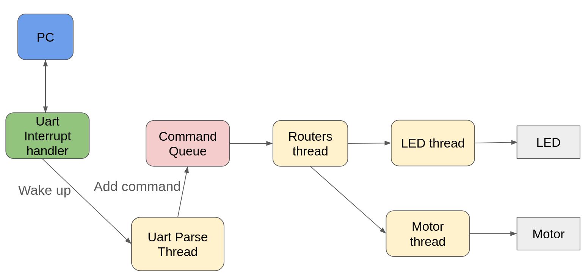
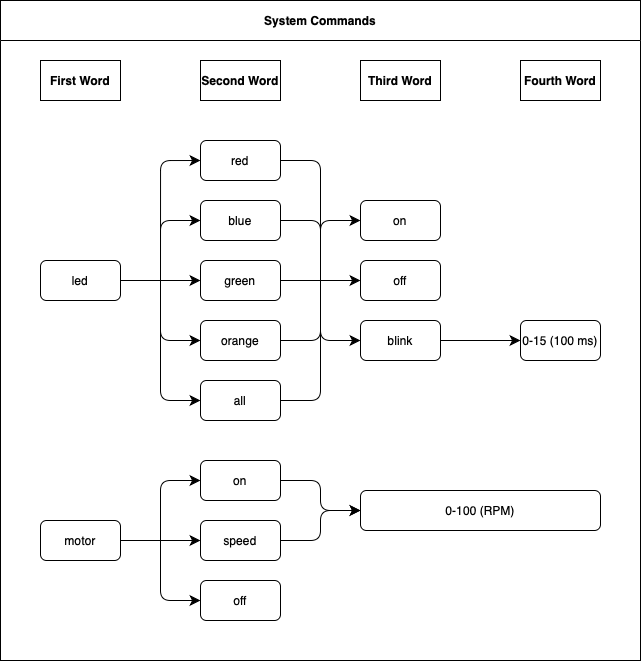
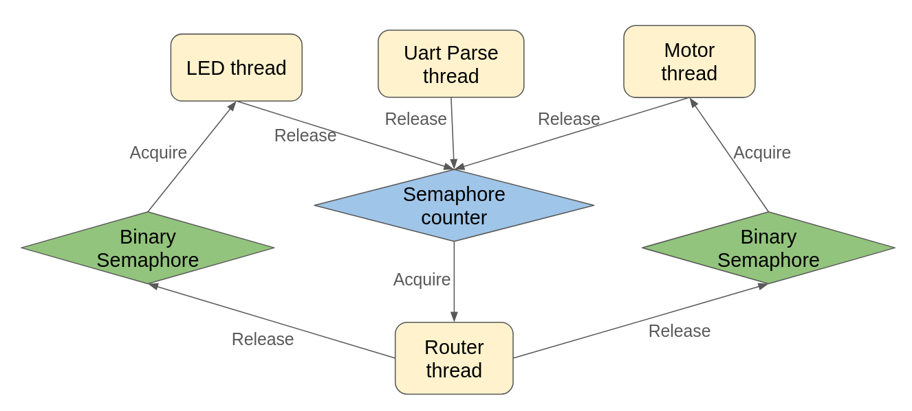

# RTOSCommander: Controls the RTOS through a command-line interface
Group members: Jie Yang, Sanjay Gounder, Adam Blakeslee

## Project Overview
We built a simple command-line interface for some basic tasks using an RTOS to interact with hardware.

* The microcontroller that has FreeRTOS is connected to a PC via UART.
* The UART Parse thread process user commands and push the command to Command Queue.
* The Command Queue is used to store commands from user.
* The Router thread distributes tasks for worker threads.
* There are two worker threads, LED and Motor threads, each thread works on separate task.
* The function procedure is shown below: 
1. PC sends message via UART, and the UART interrupt handler will save user's input.
2. When a command reaches the end (terminated with ‘\n’), the UART interrupt handler will wake up the Uart Parse thread.
3. Then the Uart Parse thread starts processing the command, and pushes it to the command queue.
4. Every time the Uart Parse thread pushes a new command to the command queue, it will wake up the router thread to check if the corresponding worker thread is idle.
5. When the worker thread (currently LED and Motor thread) is idle, the router thread will fetch the command for that worker thread, assign the task to the worker thread, and then wake up the worker thread.
6. When a worker thread finishes the task, it will go to sleep and wake up the router thread to schedule tasks.

## User command format
The User command format is shown in the following picture.

* We support two types of commands: LED and Motor. Each command begins with the type of operation indicated as the first word.
* For LED command,  the second word specifies the color (red, blue, green, orange, or all), while the third word denotes the operation (turn on, turn off, or blink). If 'blink' is selected, the fourth word sets the blink interval in increments of 100 milliseconds within the range of 0 to 15.
* Motor commands offer three operations: turn on, turn off, and adjust speed. When turning on or adjusting speed, the user specifies the desired revolutions per minute (RPM), ranging from 0 to 100.

## Threads Synchronization
The synchronization between different threads are shown in the following picture.

* We employ a semaphore counter mechanism to facilitate communication between threads in our system. The UART thread releases the semaphore counter when it pushes a new command to the command queue. When the LED thread completes its task, before transitioning to a sleep state, it releases the semaphore counter; meanwhile when the Motor thread completes its task, before transitioning to a sleep state, it releases the semaphore counter. The release operation will increase the semaphore counter by one. The router thread tries to acquire semaphore ocunter, when the counter is greater than 0, it will be woken up and the semaphore counter subtract 1, when the counter is 0, it keeps sleep.
* We use two separate binary semaphore for Router to wake up the LED thread and Motor thread respectively. When the Router thread receives a command relevant to a specific thread and the thread is idle, it releases the corresponding binary semaphore, thereby waking up the designated thread to process the received command.

## Instructions how to set it up
1. Connect UART and motor driver to pins shown in the following table.

2. Open a serial terminal on your computer with the following parameters.

3. Power on the discovery board. The system will transmit "UART Enabled" to the terminal to indicate the system is ready to receive commands.
